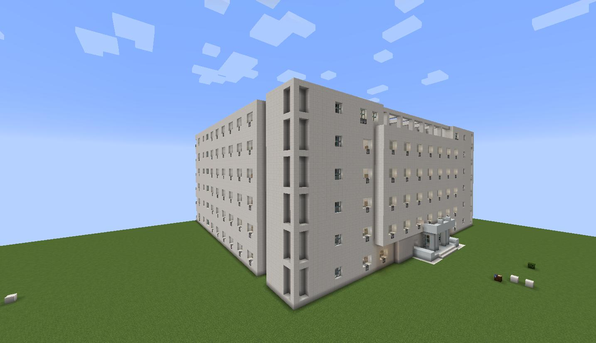

## 欢迎来到第三新吉大

### 故事背景

西历2020年，在第三次冲击(Third Impact)之后，人类被迫全体方块化，为了抵抗使徒(Shito)的冲击，人们开始建造对抗使徒的要塞大学——第三新吉大。这一计划又被称为**吉大补完计划**。

### 目的

* 我们旨在mc中还原吉林大学(优先进行中心校区)。
* 依托多人服务器进行，以及其他辅助技术进行建造工作。
* 建造完成后，本项目将公开地图。

欢迎更多对在我的世界中建造吉林大学的朋友参与。

**QQ群：711406085**

### 人才缺口

我们需要可以一天爆肝8小时的肝帝/可以利用Java或者其他语言进行辅助建设的程序员/有吉林大学相关建筑数据的内部人士/以及欢迎安静吃瓜搭个方块的萌新

### 如何加入

目前服务器只对正版用户开放，加入QQ群，展现自己能力便可以进入服务器的白名单。

### 现状

目前第三新吉大基于1.14.4 paper端服务器。以创造模式进行工作。

已经完成原南苑第一公寓的建造工作，正在进行图书馆，经信教学楼及其他建筑的建造和规划。

并且利用Mathematica完成了吉林大学校徽的设计。
